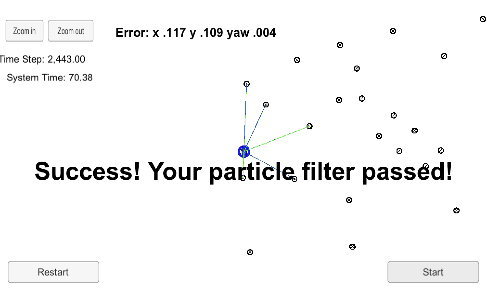
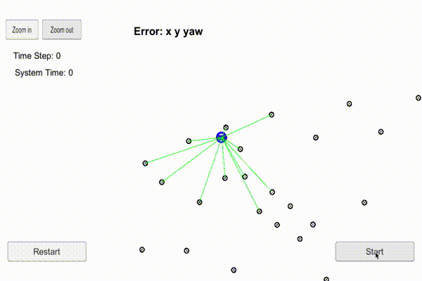

# Kidnapped Vehicle using Particle Filter (PF) Project

| **Source Code**  | [https://github.com/aurangzaib/CarND-Kidnapped-Vehicle-Project](https://github.com/aurangzaib/CarND-Kidnapped-Vehicle-Project)  |
|:-----------|:-------------|
| **Overview**  | `README.md`  |
| **Setup**  | `SETUP.md`  |
|**PF Implementation**| `src/particle_filter.cpp`|
| **How to run**  | `mkdir build && cd build` | 
| |`cmake .. && make`     	|
| |`./particle_filter`     		|

## Introduction:

A robot is transported to a new location where current location of the robot is unknown.

A two dimensional Particle Filter is implemented to localize the robot by providing the best estimate of the current location (x, y) of the robot and association with map landmarks.

##### Input to Particle Filter:

- A map of it's location with landmarks
- A noisy GPS estimate (x, y, heading) of its initial location
- Noisy Laser sensor observations (x, y)
- Noiseless control data (velocity and turn rate)

##### Output of Particle Filter:

- Best location estimate of robot
- Association with map landmarks

##### The steps of the project are as following:

- Read map landmarks (x, y) and noisy GPS data (x, y, theta)
- Initialize Particle Filter.
- Read previous velocity (v) and turn rate (yaw_rate)
- Predict next state.
- Read noisy Laser sensor observation data (x, y) and transform it from Vehicle Coordinate System (VCS) to Map Coordinate System (MCS)
- Update each Particle's Importance Weights
- Resample Particles with respect to their Importance Weights

## Explanation of the code:

The implementation of UKF is divided into 4 files:

`main.cpp`

`particle_filter.cpp`

Following table summarizes the purpose of each file:

| File | Explanation |
|:-----------|:-------------|
|**main.cpp**| |
|				| Define uncertainties of GPS and map landmarks measurements |
| 				| Read map landmarks (x, y) and noisy GPS data (x, y, theta) | 
|				| Call `init` method of class `ParticleFilter` |
|				| Read previous velocity (`v`) and turn rate (`yaw_rate`) |
|				| Call `prediction` method of class `ParticleFilter` |
|				| Read noisy Laser sensor observation data |
|				| Call `updateWeights` method of class `ParticleFilter` |
|				| Call `resample` method of class `ParticleFilter` |
|				| Call `getSenseX` and `getSenseY` method of class `ParticleFilter` to get best location estimate of robot|
|				| Call `getAssociations` method of class `ParticleFilter` to get associations with map landmarks|
|**particle_filter.cpp**| |
|`init` | |
| 				| Define `num_particles` |
| 				| Set each particle's position and orientation |
| 				| Set each particle's weight to 1 |
|`prediction` | |
| 				| Update each particle's position (`x, y`) and orientation (`theta`) from given velocity and turn rate (`velocity, yaw_rate`) |
|`updateWeights` | |
| 				| Transform Laser sensor observation from VCS to MCS | 
| 				| Find nearest landmark to each observation using distance formula |
|				| Calculate normalized probability for each observation using multi-variate Gaussian distribution |
|				| Update each particle's weight by combining normalized probabilities | 
|`resample`	|	|
|				| Use `Resample Wheel` algorithm to reorder particles with respect to their importance weights |

## Results:

The project is successfully passed:

The video (GIF) below shows results of Object localization using Particle Filter:

